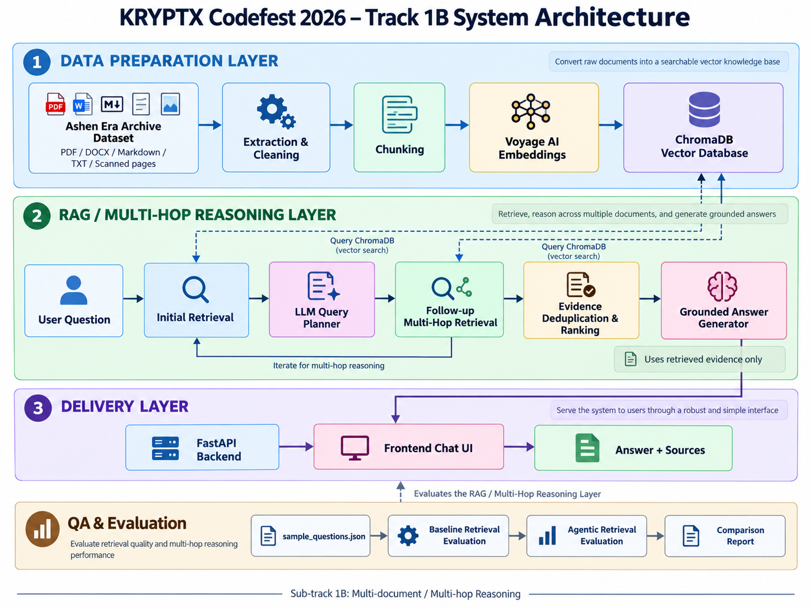

# CODEFEST KRYPTX – Ashen Era Intelligent Document Assistant

[](https://www.python.org/)
[](https://fastapi.tiangolo.com/)
[](https://nextjs.org/)
[](https://www.trychroma.com/)
[](https://www.voyageai.com/)

An AI-powered multi-document question answering system developed for the **SLIIT Codefest 2026 AI Innovation Challenge – Sub-track 1B: Connecting Facts Across Thousands of Pages**.

The system connects multi-hop facts spanning the 415-document **Ashen Era Archive** (novels, wiki articles, codex data tables, and ephemera) to synthesize strictly grounded answers with verifiable source attributions.

---

## 🏛️ System Architecture



```text
User Question 
     │
     ▼
[ Hop 1: Dense Vector Retrieval (Voyage AI + ChromaDB) ]
     │
     ▼
[ LLM Query Planner (Entity Extraction & Disambiguation) ]
     │
     ▼
[ Hop 2/3: Multi-Hop Entity Traversal (Connecting Relationships) ]
     │
     ▼
[ Evidence Ranking (Multi-factor Relevance & Diversity Scoring) ]
     │
     ▼
[ Grounded Answer Synthesis (Direct Bold Answer + Bulleted Reasoning + Deterministic Citations) ]
```

---

## ⚡ Quickstart Guide (Run from Scratch)

Judges and evaluators can run the complete application locally using either the automated script or standard terminal commands.

### 1. Prerequisites
- **Python**: Version 3.10, 3.11, 3.12, or 3.13
- **Node.js**: Version 18.x, 20.x, or 22.x (with `npm`)
- **Git**

### 2. Clone & Environment Setup

```bash
# Clone the repository
git clone https://github.com/IT25100488/CODEFEST_KRYPTX.git
cd CODEFEST_KRYPTX

# Create and activate Python virtual environment
python -m venv .venv

# On Windows:
.venv\Scripts\activate

# On Linux / macOS:
source .venv/bin/activate

# Install backend dependencies
pip install -r requirements.txt

# Install frontend dependencies
cd frontend
npm install
cd ..
```

### 3. Configure Environment Variables

Copy the example configuration file:

```bash
cp .env.example .env     # On Linux / macOS
copy .env.example .env   # On Windows
```

Ensure `.env` contains your active API keys:
```env
OPENROUTER_API_KEY=your_openrouter_api_key_here
VOYAGE_API_KEY=your_voyage_api_key_here
```

---

## 🚀 Running the Project

### Option A: One-Click Startup (Windows)

Double-click or execute the provided launch script:
```cmd
start_app.bat
```
This automatically launches both the FastAPI backend and Next.js frontend in separate console windows.

### Option B: Manual Command Line

**Terminal 1 — Backend (FastAPI):**
```bash
# Ensure virtual environment is activated
.venv\Scripts\activate   # Windows
# or source .venv/bin/activate

uvicorn api.main:app --host 127.0.0.1 --port 8000 --reload
```
*Backend runs at: [http://127.0.0.1:8000](http://127.0.0.1:8000)*  
*Interactive API Docs (Swagger): [http://127.0.0.1:8000/docs](http://127.0.0.1:8000/docs)*

**Terminal 2 — Frontend (Next.js):**
```bash
cd frontend
npm run dev
```
*Frontend runs at: [http://localhost:3000](http://localhost:3000)*

---

## 🧪 Running Benchmarks & CLI Testing

### Run Track 1B Automated Evaluation
The repository includes an evaluation suite against multi-hop benchmark questions:
```bash
python evaluation/evaluate_track_1b.py
```

### Run RAG Pipeline in Interactive CLI Mode
To test the multi-hop reasoning directly in the terminal without starting the web UI:
```bash
python -m rag.pipeline
```

---

## 📂 Project Organization

```text
CODEFEST_KRYPTX/
├── api/                  # FastAPI web server and route controllers
│   ├── __init__.py
│   └── main.py           # REST endpoints (/api/health, /api/chat)
├── ai_usage/             # AI disclosures and developer interaction logs
│   ├── ai-usage-disclosure.md  # Mandatory AI usage report
│   └── chat_logs/        # Exported development logs
├── data/                 # Raw and processed archive corpus
│   └── vector_db/        # Persistent ChromaDB vector database
├── data_pipeline/        # Text extraction, chunking, and embedding scripts
│   ├── extract_text.py
│   ├── create_vector_database.py
│   └── retriever.py
├── docs/                 # Architectural documentation & ADRs
│   ├── architecture.md   # Detailed system design
│   ├── decisions.md      # Key technical decisions and trade-offs
│   ├── limitations.md    # Known limitations and failed approaches
│   └── diagrams/         # Architectural visual diagrams
├── evaluation/           # Track 1B multi-hop evaluation scripts & metrics
│   ├── evaluate_track_1b.py
│   └── agentic/
├── frontend/             # Next.js 16 App Router UI
│   ├── src/app/          # Pages and API reverse proxy routes
│   ├── src/components/   # Chat bubbles, thinking indicators, evidence drawers
│   └── package.json
├── llm/                  # LLM integrations with exponential backoff
│   ├── client.py         # OpenRouter gateway client
│   └── query_planner.py  # Multi-hop query decomposition
├── rag/                  # Core RAG pipeline
│   ├── answer_generator.py # Evidence-grounded synthesis
│   └── pipeline.py       # Orchestration pipeline
├── retrieval/            # Multi-hop retrieval algorithms
│   ├── agentic_multi_hop.py # Dynamic entity traversal
│   └── evidence_ranker.py   # Composite scoring and deduplication
├── requirements.txt      # Python dependencies
├── start_app.bat         # Automated application launcher
└── README.md
```

---

## 👥 Team KRYPTX (SLIIT Codefest 2026)

- **Sub-track**: Track 1B — *Connecting Facts Across Thousands of Pages*
- **Institution**: Sri Lanka Institute of Information Technology (SLIIT)
- **Roles & Contributions**:
  - **Data Engineering**: Corpus extraction, chunking heuristics, Voyage AI vectorization.
  - **Core AI & RAG Backend**: Multi-hop query planner, evidence ranking, grounded answer generator, FastAPI.
  - **Frontend & UI/UX**: Next.js 16 chat interface, reasoning traces, interactive source viewer.
  - **QA & Benchmarking**: Metric evaluation, rate-limit backoff survival, documentation.